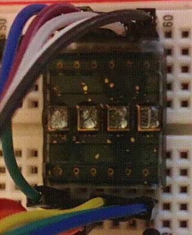

# HPDL-1414 Test

A quick bit of code to test the HPDL-1414 device with the Arduino. [See the datasheet](https://datasheetspdf.com/pdf-file/1252628/Agilent/HPDL-1414/1).

## Configuration

There are a numbber of macros defined at the top of the ino file:

- `DS_x`: the arduino pin to which the numbered digit select pin is connected.
- `DI_x`: the arduino pin to which the numbered data input pin is connected.
- `N_WR`: the arduino pin to which the active low write pin is connected.
- `FRAME_LEN_MS`: the number of milliseconds each scrolling frame should be displayed.

Other macros are explained inline, and should stay constant for this device.

## Usage

### `scrollMessage(char *)`

Scrolls the text defined in the input parameter across the screen.  Note that the string must be terminated by a null (`\0`) character.  If you're not familiar with C, `"double quoted"` strings are terminated with `\0` automatically.

## Test setup

This was tested on an Arduino Duemilanove with the following wiring:

| HPDL-1414 Pin | Arduino Pin (Digital) |
|---------------|-----------------------|
| 1             | 9                     |
| 2             | 7                     |
| 3             | 6                     |
| 4             | 5                     |
| 5             | 4                     |
| 6             | 5V                    |
| 7             | GND                   |
| 8             | 13                    |
| 9             | 12                    |
| 10            | 11                    |
| 11            | 10                    |
| 12            | 8                     |

